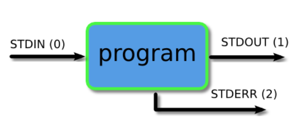
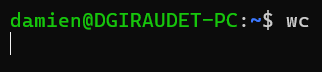
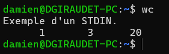
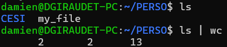

# J2

Le vendredi 8 novembre de 8h30 à 16h30

## Sujets à aborder (fiche pédagogique)

- Commandes liées aux concepts de base
- Redirection des entrées/sorties

## Partie 1 : Révision du J1

Voir le fichier `J1-cours.md` pour les détails.

## Partie 2 : Les redirections

*Source : [Piping and Redirection](https://ryanstutorials.net/linuxtutorial/piping.php)*

> Quand j'utilise la commande `ls` dans mon terminal,
>
> le résultat est envoyé vers la sortie standard (STDOUT), et mon terminal l'affiche.
>
> C'est le comportement par défaut, identique pour les erreurs (STDERR).

### STDOUT : Les redirections vers un fichier : `>` et `>>`

La redirection `>` permet de rediriger STDOUT vers un fichier.

> Lorsque j'exécute `ls > my_file` dans mon terminal,
>
> le résultat est envoyé vers STDOUT.
>
> Dans ce cas, le résultat de la commande est stocké dans `my_file` (je peux vérifier avec `cat my_file`).

La redirection de base va écraser le contenu de mon fichier.

Si je veux ajouter le résultat à la fin de mon fichier sans le remplacer, j'utilise `>>`.

### STDIN : Les redirections depuis un fichier : `<`

> La commande `wc` (acronyme de word count) permet de compter les mots, lignes, et caractères dans un fichier.
>
> 
>
> Ici, j'ai tapé `wc`, puis appuyé sur ENTRÉE.
>
> Mon curseur attend une entrée (je peux taper du texte).
>
> Ce texte sera envoyé à STDIN (Standard Input) de la commande `wc`.
>
> Pour terminer l'entrée, j'utilise `CTRL + D` (signifiant la fin de fichier, EOF).
>
> 

Je peux rediriger un fichier vers STDIN en utilisant `<`,
ou via certaines commandes qui acceptent la saisie de STDIN dans le terminal.

> Par exemple, `wc < my_file` produira (presque) le même résultat que `wc my_file`.

### Les pipes : `|`

Les pipes permettent de rediriger STDOUT d'une commande vers STDIN d'une autre commande.

> Quand j'exécute `ls | wc` dans mon terminal,
>
> le résultat de `ls` est envoyé vers STDOUT.
>
> Ce résultat est ensuite redirigé vers STDIN de la commande `wc`.
>
> `wc` va compter le nombre de lignes, de mots et de caractères.
>
> 

Les pipes peuvent être enchaînés.

> Que fait la commande suivante : `history | grep cd | wc -w` ?

### Bonus : Les autres sorties

- `2>` : STDERR
- `2>>` : STDERR (append)
- `&>` : STDOUT et STDERR
- `&>>` : STDOUT et STDERR (append)

"Append" signifie que le résultat est ajouté à la fin du fichier.

## Partie 3 : Commandes utiles pour parcourir de gros fichiers

- `tail` : Affiche les dernières lignes d'un fichier
- `head` : Affiche les premières lignes d'un fichier
- `less` : Affiche le contenu d'un fichier page par page
- `grep` : Permet de rechercher des mots dans un fichier
- `find` : Permet de rechercher des fichiers
- `sort` : Permet de trier les lignes d'un fichier
- `uniq` : Permet de supprimer les doublons
- `cut` : Permet de découper les lignes
- `awk` : Permet de manipuler des colonnes
- `wc` : Permet de compter les mots
- `diff` : Permet de comparer des fichiers

Toutes ces commandes peuvent être utilisées avec des arguments. Utilisez `man` pour lire la documentation.

Ces commandes peuvent être combinées avec les redirections et les pipes.

A minima, il est recommandé de savoir utiliser les commandes `wc`, `grep` et/ou `find`, ainsi qu'`awk`.
